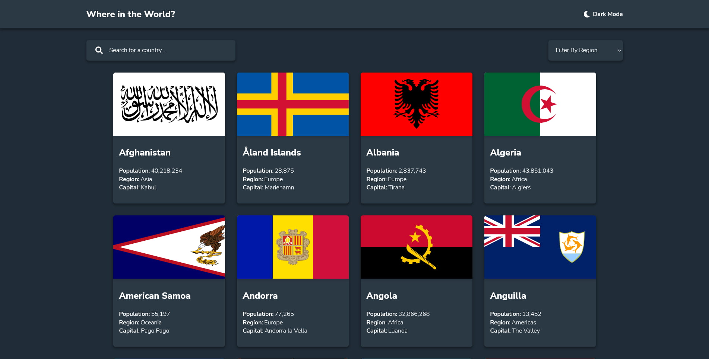

# Frontend Mentor - REST Countries API with color theme switcher solution

This is a solution to the [REST Countries API with color theme switcher challenge on Frontend Mentor](https://www.frontendmentor.io/challenges/rest-countries-api-with-color-theme-switcher-5cacc469fec04111f7b848ca). Frontend Mentor challenges help you improve your coding skills by building realistic projects.

## Table of contents

- [Overview](#overview)
  - [The challenge](#the-challenge)
  - [Screenshot](#screenshot)
  - [Links](#links)
- [My process](#my-process)
  - [Built with](#built-with)
  - [What I learned](#what-i-learned)
- [Author](#author)

## Overview

### The challenge

Users should be able to:

- See all countries from the API on the homepage
- Search for a country using an `input` field
- Filter countries by region
- Click on a country to see more detailed information on a separate page
- Click through to the border countries on the detail page
- Toggle the color scheme between light and dark mode *(optional)*

### Screenshot

### Links

- [Solution URL](https://github.com/Serj-L/Countries-app)
- [Live Site URL](https://serj-l.github.io/Countries-app)

## My process

### Built with

- Semantic HTML5 markup
- CSS modules
- CSS custom properties
- Grid
- Flexbox
- [React](https://reactjs.org/)
- [React Router v6](https://reactrouter.com/)

**Note: These are just examples. Delete this note and replace the list above with your own choices**

### What I learned

During developing this project I dive deeper into React Router v6 hooks.

## Author

- Website - [Serj-L](https://serj-l.github.io/Profile)
- Frontend Mentor - [@Serj-L](https://www.frontendmentor.io/profile/yourusername)
- LinkedIn - [Sergei Lepnyakov](https://www.linkedin.com/in/serj-l)

